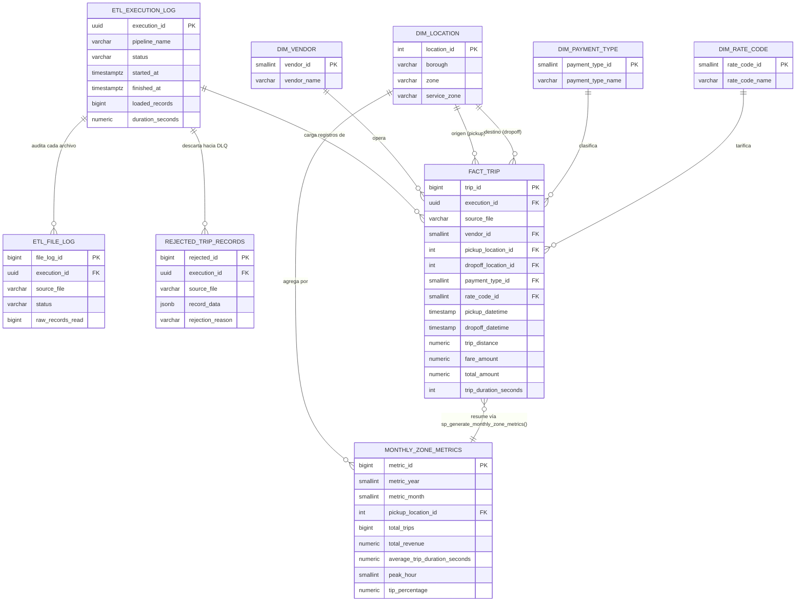

# Arquitectura del Pipeline - Simón Movilidad

## 1. Visión General de la Arquitectura por Esquemas SQL

```text
NYC TLC Parquet (portal oficial TLC)
       │
       ▼
┌──────────────────┐
│ BRONZE            │  Descarga batch por mes (cacheada en ./data/bronze)
│ (archivos crudos) │  Auditoría Fase 1: audit.etl_file_log por archivo
└────────┬──────────┘
         │  lectura en streaming (DuckDB, lotes de 250k filas)
         ▼
┌──────────────────┐
│ SILVER            │  Limpieza y validación de reglas de negocio
│                   │  Dimensiones (vendor, location, payment_type, rate_code)
│                   │  Hechos: silver.fact_trip (FK a todas las dimensiones)
│                   │  Dead Letter Queue: silver.rejected_trip_records
└────────┬──────────┘
         │  CALL gold.sp_generate_monthly_zone_metrics()
         ▼
┌──────────────────┐
│ GOLD              │  Función PL/pgSQL: métricas por zona/mes
│                   │  (recaudo, duración promedio, hora pico, % propina)
│                   │  Auditoría Fase 3: cierre de audit.etl_execution_log
└────────┬──────────┘
         │
         ▼
┌──────────────────┐
│ Flask API (Docker)│  GET /api/v1/metrics  (filtrable por year/month/zone)
│                   │  GET /api/v1/health   (telemetría de auditoría)
└──────────────────┘
```

### Flujo de ejecución (`etl/pipeline.py`)

1. Se crea un registro en `audit.etl_execution_log` con estado `RUNNING` (Fase 1: inicio de la ejecución completa).
2. Por cada mes solicitado:
   a. `etl/extract/downloader.py` descarga el Parquet del portal TLC (`data/bronze/`), o reutiliza el archivo si ya existe (idempotencia). La descarga es atómica (`.part` + rename) para que una interrupción no deje un archivo truncado que la siguiente corrida dé por bueno.
   b. Se abre un registro en `audit.etl_file_log` (Fase 1: nombre de archivo + inicio) — un registro por archivo, complementario al de la ejecución completa.
   c. Se purga la carga anterior de **ese mismo archivo** (`DELETE ... WHERE source_file = ...` sobre hechos y DLQ), lo que hace que reprocesar un mes sea idempotente.
   d. `etl/transform/cleaner.py` lee el Parquet **en lotes** vía DuckDB (`to_arrow_reader`), valida cada lote (`etl/transform/validators.py`) y separa registros válidos/rechazados.
   e. Los válidos se insertan en `silver.fact_trip` por lote (`execute_values`, `page_size=5000`); los rechazados van a `silver.rejected_trip_records` con la razón del descarte.
   f. Se cierra el registro de `audit.etl_file_log` con el estado y los conteos de ese archivo.
3. Se ejecuta el procedimiento almacenado `gold.sp_generate_monthly_zone_metrics()` que recalcula la capa Oro completa.
4. Se cierra `audit.etl_execution_log` (Fase 3): fecha de fin, total de registros cargados en la capa final y tiempo total de procesamiento. Si cualquier paso falla, la ejecución (y el archivo en curso, si aplica) se marca `FAILED` con el mensaje de error, y la excepción se propaga.

---

## 2. Decisiones de Arquitectura

- **Procesamiento en lotes con DuckDB (`to_arrow_reader`)**: un mes de datos de taxis puede tener varios millones de filas. En lugar de materializar el archivo Parquet completo en un único `DataFrame` (lo que puede desbordar la memoria RAM), `cleaner.py` itera el archivo en lotes de `CHUNK_SIZE=250_000` filas usando el `RecordBatchReader` de Arrow que expone DuckDB. Cada lote se valida y se inserta a PostgreSQL de forma independiente, acotando el uso de memoria sin importar el tamaño total del archivo.
- **DuckDB como motor de lectura, PostgreSQL como motor transaccional**: DuckDB lee Parquet columnar de forma muy eficiente (proyección de columnas, sin cargar el archivo completo a disco temporal); PostgreSQL se usa como base transaccional para servir la API y garantizar integridad referencial.
- **Auditoría en dos niveles**: `audit.etl_execution_log` resume la ejecución completa (puede abarcar varios meses/archivos) y es el registro que cierra la Fase 3 con las métricas agregadas de cierre. `audit.etl_file_log` (Fase 1) guarda un renglón por **cada archivo Parquet procesado** — nombre de archivo, registros crudos leídos y estado (running/success/failed) — que es el detalle que exige la trazabilidad por archivo. Ambas tablas están relacionadas por `execution_id` (FK).
- **Dead Letter Queue con payload completo**: `silver.rejected_trip_records` guarda el registro original completo en `record_data JSONB` junto con la razón de rechazo (`rejection_reason`), lo que permite reprocesar o auditar manualmente sin volver a tocar el Parquet original.
- **Doble capa de validación de calidad**: los filtros se aplican en Python (`validators.py`, antes de insertar) **y** se refuerzan con `CHECK` constraints en `silver.fact_trip` (distancia > 0, fechas válidas, tarifa >= 0) como defensa adicional a nivel de base de datos.
- **Índices dirigidos a los patrones de consulta reales**: `idx_fact_trip_pickup_dt` para filtros por fecha, `idx_fact_trip_pu_loc_pickup` (índice compuesto) para el patrón de agregación por zona+fecha que usa el procedimiento almacenado, `idx_fact_trip_source_file` para la purga de reprocesos, e `idx_gold_metrics_year_month` para el filtro principal del endpoint `/api/v1/metrics`.
- **Dimensión de ubicación poblada desde el diccionario oficial de datos**: `silver.dim_location` se carga con las 265 zonas del `taxi_zone_lookup.csv` publicado por la propia TLC (mismo dominio que los archivos de viajes), no con valores de ejemplo. Esto es lo que permite que la FK `fact_trip → dim_location` se cumpla con datos reales de producción.
- **Recargas idempotentes por archivo**: `silver.fact_trip` guarda `source_file` y el pipeline borra la carga previa de ese archivo antes de insertar. Sin esto, reprocesar `2024-01` insertaría ~3M de hechos duplicados y la Capa Oro reportaría el doble de recaudo. Los logs de auditoría de la corrida anterior se conservan como evidencia (no se borran).
- **Un solo pipeline para Yellow y Green**: la proyección SQL se construye con el prefijo de fecha del dataset (`tpep_` en Yellow, `lpep_` en Green) y normaliza ambos a `pickup_datetime`/`dropoff_datetime`. El resto del pipeline (validación, carga, agregación) es idéntico para los dos.
- **Construcción vectorizada de las tuplas de inserción**: se usa `Series.tolist()` por columna en vez de `iterrows()`. Además de ser mucho más rápido sobre millones de filas, es un requisito de corrección: psycopg2 no sabe adaptar `numpy.int64` (`can't adapt type`) y adapta mal `numpy.float64`; `tolist()` devuelve tipos nativos de Python.
- **Pool de conexiones en la API**: `psycopg2.pool.ThreadedConnectionPool` detrás de un context manager (`db_cursor`) que garantiza la devolución de la conexión incluso ante excepción. Abrir una conexión por request cuesta ~5-20 ms y, bajo concurrencia, agota `max_connections` del servidor.
- **Gunicorn como servidor WSGI**: el servidor de desarrollo de Flask es monohilo y el propio framework advierte que no es para producción. El contenedor de la API corre Gunicorn con workers parametrizables y usuario no-root.

---

## 3. Modelo de Datos Relacional

### Esquemas PostgreSQL:
- **`bronze`**: namespace reservado para trazabilidad de archivos crudos (el archivo físico vive en `data/bronze/`, fuera de la base de datos, para no duplicar datos columnar-comprimidos dentro de PostgreSQL).
- **`audit`**:
  - `etl_execution_log`: una fila por ejecución del pipeline (puede cubrir N meses). Fase 1 (inicio) y Fase 3 (cierre: `finished_at`, `loaded_records`, `duration_seconds`).
  - `etl_file_log`: una fila por archivo procesado dentro de una ejecución (Fase 1 granular: `source_file`, `raw_records_read`, `status`).
- **`silver`**:
  - Dimensiones: `dim_vendor`, `dim_rate_code`, `dim_payment_type`, `dim_location` (265 zonas oficiales TLC).
  - Hechos: `fact_trip` (FK a las 4 dimensiones + FK a `audit.etl_execution_log`).
  - DLQ: `rejected_trip_records` (payload `JSONB` + razón de rechazo).
- **`gold`**: `monthly_zone_metrics` — métricas mensuales agregadas por zona, con `UNIQUE(metric_year, metric_month, pickup_location_id)` y `ON CONFLICT ... DO UPDATE` para que el procedimiento almacenado sea idempotente (se puede re-ejecutar sin duplicar filas).

### Diagrama Entidad-Relación



### Procedimiento Almacenado (`gold.sp_generate_monthly_zone_metrics`)

Recalcula, por año/mes/zona de recogida, sobre `silver.fact_trip`:
- `total_trips`, `total_revenue` (`SUM(total_amount)`).
- `average_trip_duration_seconds` (`AVG(trip_duration_seconds)`).
- `peak_hour`: hora del día con más viajes, calculada con `ROW_NUMBER() OVER (PARTITION BY año, mes, zona ORDER BY conteo DESC)`.
- `tip_percentage`: `SUM(tip_amount) / SUM(fare_amount) * 100`.

El `INSERT ... ON CONFLICT (metric_year, metric_month, pickup_location_id) DO UPDATE` permite volver a llamar el procedimiento tras cargar más meses sin generar filas duplicadas.

---

## 4. Endpoints Flask

| Método | Ruta | Descripción | Filtros |
|---|---|---|---|
| GET | `/api/v1/metrics` | Métricas agregadas por zona (capa Oro) | `year`, `month`, `location_id`, `limit` (máx 500), `offset` |
| GET | `/api/v1/health` | Telemetría de auditoría del pipeline: última ejecución, últimas N ejecuciones, últimos N logs por archivo, total y desglose por razón en la DLQ | `limit` (default 10, máx 100) |

Decisiones transversales de ambos endpoints:
- `psycopg2.extras.RealDictCursor`: la fila ya llega como diccionario serializable a JSON.
- **Techo duro de resultado** (`LIMIT` acotado en servidor, no por el cliente) para que ninguna petición pueda pedir un resultado ilimitado.
- **Validación de filtros antes de consultar**: `month=13` devuelve `400` sin abrir una conexión.
- **Filtros siempre como parámetros ligados** (`%s`), nunca por interpolación de strings: defensa contra inyección SQL.
- **Los errores internos no se filtran al cliente**: el detalle va al log del servidor y la respuesta es un `503` genérico (el mensaje de una excepción de psycopg2 puede exponer host, usuario o esquema).

---

## 5. Estrategia de Migración a Streaming (Batch -> Streaming)

Para hacer evolucionar la arquitectura hacia un procesamiento en tiempo real manteniendo calidad, gobierno y seguridad de los datos:

1. **Ingesta de Eventos en Tiempo Real**: reemplazar la descarga batch por un tópico en **Apache Kafka** o **Redpanda** (`taxi-events`), donde cada viaje finalizado se publica como evento individual (en vez de esperar el archivo mensual completo).
2. **Schema Registry**: uso de Confluent Schema Registry (Avro/Protobuf) para forzar contratos de esquema estrictos entre productores y consumidores — reemplaza la validación de tipos que hoy hace el `SELECT ... CAST(...)` de DuckDB sobre el Parquet.
3. **Procesamiento de Streams (Flink / Spark Structured Streaming / ksqlDB)**: aplicar las mismas reglas de `etl/transform/validators.py` (distancia > 0, fechas consistentes, tarifa >= 0) como validación *in-flight*, evento por evento, en vez de por lote. Las dimensiones (`dim_location`, `dim_vendor`, etc.) se consultan como *lookup tables* materializadas en el motor de streaming (o vía CDC desde PostgreSQL).
4. **Dead Letter Queue como tópico**: los eventos que no pasan la validación se publican en `taxi-events-dlq` con la razón de rechazo en la cabecera del mensaje — preserva la misma semántica de auditoría de calidad que hoy tiene `silver.rejected_trip_records`, pero desacoplada y reprocesable.
5. **Auditoría continua**: en vez de un `audit.etl_execution_log` por ejecución batch, se emiten métricas de streaming (throughput, lag de consumo, tasa de rechazo) a un sistema de observabilidad (Prometheus/Grafana), con agregaciones por ventana de tiempo (tumbling window de 1 minuto, por ejemplo) que alimentan una tabla equivalente a `gold.monthly_zone_metrics` pero actualizada incrementalmente.
6. **Gobierno y seguridad**: cifrado en tránsito (TLS 1.3) y en reposo (KMS), autenticación SASL/SCRAM o mTLS entre productores/consumidores, control de acceso por tópico (ACLs), y catálogo de datos (ej. Data Catalog / OpenMetadata) para mantener el linaje y las definiciones de calidad de dato consistentes entre el mundo batch histórico y el streaming nuevo, permitiendo queries híbridas (Lambda architecture) mientras dura la transición.

---

## 6. Alcance y Limitaciones Conocidas

- El procedimiento `gold.sp_generate_monthly_zone_metrics()` recalcula **toda** la tabla `silver.fact_trip` en cada llamada. Para un histórico de muchos años esto se vuelve costoso; una evolución natural es parametrizarlo por rango de fechas o materializar solo el mes recién cargado.
- La ejecución del pipeline es secuencial por mes (no paralela). Para cargas masivas de histórico (años completos) conviene paralelizar por mes usando múltiples ejecuciones del contenedor `etl` (cada una ya es idempotente y queda auditada de forma independiente).
- `silver.fact_trip` no está particionada. A partir de ~50-100M de filas conviene particionar por rango de `pickup_datetime` (mensual), lo que además convierte la purga de un reproceso en un `DROP PARTITION` en vez de un `DELETE`.
- La API corre con Gunicorn dentro del contenedor, pero sin proxy inverso (TLS, rate limiting) ni autenticación: en producción iría detrás de Nginx/API Gateway con autenticación por token y límite de peticiones por cliente.
- Las métricas de la Capa Oro se agregan por zona de **recogida** (`pickup_location_id`). Un análisis de flujos origen-destino requeriría una tabla agregada adicional por par de zonas.
